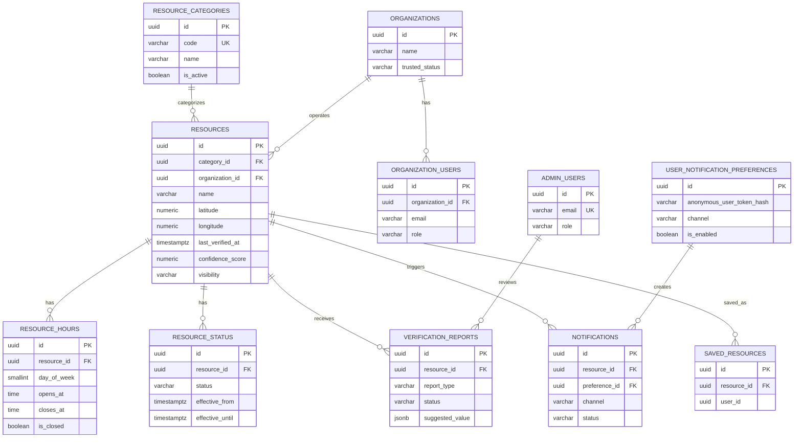
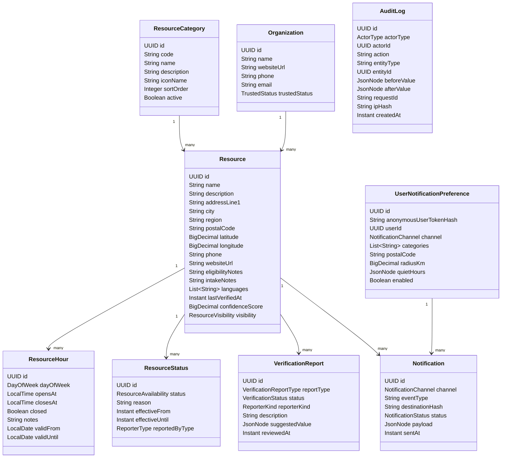
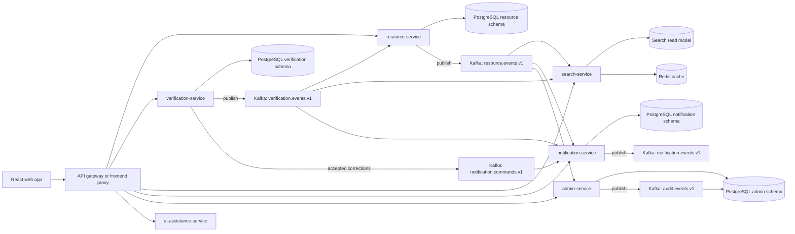

# Harbor Planning Package

Harbor is a lightweight, privacy-first survival assistance platform for finding nearby essentials: food, shelter, clinics, warming and cooling centers, public restrooms, libraries, charging, Wi-Fi, transportation help, and mutual aid.

The architecture should grow in phases. Start as a small monorepo with one or two Spring Boot services, PostgreSQL, React, and Docker Compose. Add Kafka once the core resource workflow exists, then split services only when the boundaries are useful.

## Core Principles

- Anonymous access for search, map/list browsing, and resource details.
- Collect the minimum data needed for the feature being used.
- Core survival features work without AI, login, push notifications, or high bandwidth.
- Prefer clear resource freshness signals over pretending data is perfect.
- Services fail independently and degrade gracefully.
- Events are used for propagation, cache invalidation, verification workflows, notifications, and audit trails.

## 1. Roadmap

### Phase 0: Planning and Architecture

Goals:

- Define the MVP user journey: search nearby help, filter by category, view details, submit a correction.
- Define initial service boundaries but implement only the first ones.
- Choose event names, database ownership, and local Docker Compose shape.
- Write privacy assumptions and data retention rules.

Deliverables:

- This planning package.
- ERD and topic design.
- Initial GitHub issue backlog.
- Architecture decision records in `docs/adr`.

### Phase 1: MVP Monorepo and Local Development

Goals:

- Create a monorepo that is easy to run locally.
- Keep the first backend small: `resource-service` plus PostgreSQL.
- Add Flyway migrations, seed data, and health endpoints.
- Add React frontend shell.

Deliverables:

- `docker-compose.yml` with PostgreSQL and backend.
- `resource-service` CRUD/read APIs.
- `web-app` with category filters and list view.
- Seed data for one city or test region.

### Phase 2: Core Backend Services

Goals:

- Stabilize owned data and core APIs.
- Add `verification-service` for reports and status updates.
- Add `search-service` only if search logic becomes meaningfully separate.

Deliverables:

- Resource details, categories, hours, status model.
- Verification report endpoint.
- Admin-only resource create/update endpoints.
- Basic API gateway or frontend proxy.

### Phase 3: Kafka Event-Driven Communication

Goals:

- Add Kafka for events that do not need to be synchronous.
- Publish resource and verification events.
- Add retry and dead-letter topics.

Deliverables:

- `resource.events.v1`
- `verification.events.v1`
- `notification.commands.v1`
- `audit.events.v1`
- Event envelope standard with `eventId`, `eventType`, `occurredAt`, `producer`, and `payload`.

### Phase 4: Frontend MVP

Goals:

- Build a fast, mobile-first interface.
- Support low bandwidth mode with list-first browsing.
- Avoid login for core use.

Deliverables:

- Search input, location/manual zip or city entry, category filters.
- Resource list and detail pages.
- Open/closed/unknown status display.
- Correction form.
- Offline-friendly cached last results if practical.

### Phase 5: Verification and Reliability Features

Goals:

- Make resource freshness visible.
- Create workflows for crowdsourced corrections and organization-confirmed updates.

Deliverables:

- Confidence score or freshness status.
- Report types: closed, wrong hours, moved, phone disconnected, unsafe, other.
- Admin moderation queue.
- Resource status history.

### Phase 6: Notifications

Goals:

- Add optional notifications without making accounts mandatory.
- Support email/SMS/push later, but start with email or in-app subscriptions.

Deliverables:

- Notification preferences by anonymous token or optional account.
- Event-triggered notifications for closures, severe weather centers, and saved resources.
- Rate limits and quiet hours.

### Phase 7: Admin and Organization Portal

Goals:

- Let trusted admins and organizations maintain data.
- Keep public data reliable without exposing private user data.

Deliverables:

- Admin login.
- Resource approval and edit screens.
- Organization ownership of resources.
- Audit logs for sensitive changes.

### Phase 8: AI Assistance

Goals:

- Add AI as a helpful layer, not a dependency.
- Translate, simplify wording, and support conversational resource search.

Deliverables:

- Plain-language explanation of resource requirements.
- Translation of public resource details.
- Conversational search that calls existing search APIs.
- AI safety rules: no invented resource facts, cite Harbor data, degrade to normal search.

### Phase 9: Observability, Security, Deployment

Goals:

- Prepare for production operations.
- Add metrics, traces, logs, alerts, and hardened configuration.

Deliverables:

- Prometheus metrics from Spring Actuator.
- Grafana dashboards.
- Central structured logs.
- Rate limiting, CORS hardening, secrets management.
- Containerized deployment target.

### Phase 10: Final Production Polish

Goals:

- Improve accessibility, resilience, and operational readiness.
- Validate with realistic data and failure tests.

Deliverables:

- WCAG-focused accessibility pass.
- Load and latency testing.
- Backup and restore runbook.
- Incident response checklist.
- Data retention and privacy policy.

## 2. Recommended Microservices

Start with `resource-service` and a frontend. Add the others when their responsibility becomes real.

| Service | Responsibilities | Owned Data | APIs | Kafka Topics | Failure Behavior |
|---|---|---|---|---|---|
| `gateway-service` | Single public API entry, routing, rate limits, CORS, optional auth validation | No business data | `/api/**` proxy routes | Can emit `audit.events.v1` for auth/admin actions | If down, app cannot reach APIs; keep simple and horizontally scalable. For MVP, use frontend proxy or Spring Cloud Gateway later. |
| `resource-service` | Resource categories, resources, hours, current status, organization links | `resources`, `resource_categories`, `resource_hours`, `resource_status`, possibly `organizations` early | Public resource read APIs; admin resource write APIs | Produces `resource.events.v1`; consumes `verification.events.v1` for accepted updates | Public reads should keep working from DB/cache if Kafka is down. Writes can persist and publish later via outbox. |
| `verification-service` | Intake correction reports, moderation workflow, verification scoring | `verification_reports` | Submit reports; admin review actions | Produces `verification.events.v1`; consumes `resource.events.v1` | If down, search still works; correction form shows temporary unavailable message. |
| `search-service` | Fast geo/category/text search, denormalized read model, cache | Search index/read model, Redis cache; no canonical resource data | Search, nearby, suggestions | Consumes `resource.events.v1`, `verification.events.v1`; may produce `search.events.v1` | If down, frontend can fall back to `resource-service` basic search or show cached last results. |
| `notification-service` | Optional subscriptions, notification delivery, rate limits | `notifications`, `user_notification_preferences` | Subscribe/unsubscribe/preferences | Consumes `resource.events.v1`, `verification.events.v1`; consumes `notification.commands.v1`; produces `notification.events.v1` | If down, resource workflows continue; notifications queue in Kafka. |
| `admin-service` | Admin dashboard APIs, moderation queue, organization user management | `admin_users`, `audit_logs`; may call resource/verification services | Admin CRUD, moderation, reports | Produces `audit.events.v1`; consumes domain events for dashboard | If down, public app unaffected. |
| `ai-assistance-service` | Translation, plain-language summaries, conversational search orchestration | Minimal prompt logs only if explicitly enabled; prefer no raw user location storage | `/ai/translate`, `/ai/explain`, `/ai/chat` | Can consume resource events to warm summaries later | If down, app hides AI tools and core search remains available. |
| `user-preference-service` | Anonymous preference tokens, saved resources later, notification preferences | `user_notification_preferences`, `saved_resources` if accounts added | Preferences, saved resources | Consumes resource deletion/status events | Optional. For MVP, keep preferences in notification service or local browser storage. |

## 3. PostgreSQL Schema Suggestions

Use UUID primary keys, `created_at`, `updated_at`, and `deleted_at` where soft deletion matters. Use PostGIS later for advanced geo queries; for MVP, latitude/longitude columns plus bounding-box filtering are enough.

```sql
CREATE TABLE resource_categories (
  id UUID PRIMARY KEY,
  code VARCHAR(80) NOT NULL UNIQUE,
  name VARCHAR(120) NOT NULL,
  description TEXT,
  icon_name VARCHAR(80),
  sort_order INTEGER NOT NULL DEFAULT 0,
  is_active BOOLEAN NOT NULL DEFAULT TRUE,
  created_at TIMESTAMPTZ NOT NULL DEFAULT now(),
  updated_at TIMESTAMPTZ NOT NULL DEFAULT now()
);

CREATE TABLE organizations (
  id UUID PRIMARY KEY,
  name VARCHAR(200) NOT NULL,
  website_url TEXT,
  phone VARCHAR(50),
  email VARCHAR(255),
  trusted_status VARCHAR(40) NOT NULL DEFAULT 'unverified',
  created_at TIMESTAMPTZ NOT NULL DEFAULT now(),
  updated_at TIMESTAMPTZ NOT NULL DEFAULT now()
);

CREATE TABLE resources (
  id UUID PRIMARY KEY,
  category_id UUID NOT NULL REFERENCES resource_categories(id),
  organization_id UUID REFERENCES organizations(id),
  name VARCHAR(220) NOT NULL,
  description TEXT,
  address_line1 VARCHAR(220),
  address_line2 VARCHAR(220),
  city VARCHAR(120),
  region VARCHAR(120),
  postal_code VARCHAR(30),
  country_code CHAR(2) NOT NULL DEFAULT 'US',
  latitude NUMERIC(9,6),
  longitude NUMERIC(9,6),
  phone VARCHAR(50),
  website_url TEXT,
  eligibility_notes TEXT,
  intake_notes TEXT,
  languages TEXT[],
  accessibility_notes TEXT,
  data_source VARCHAR(120),
  source_url TEXT,
  last_verified_at TIMESTAMPTZ,
  confidence_score NUMERIC(4,3) NOT NULL DEFAULT 0.500,
  visibility VARCHAR(40) NOT NULL DEFAULT 'public',
  created_at TIMESTAMPTZ NOT NULL DEFAULT now(),
  updated_at TIMESTAMPTZ NOT NULL DEFAULT now(),
  deleted_at TIMESTAMPTZ,
  CONSTRAINT resources_confidence_range CHECK (confidence_score >= 0 AND confidence_score <= 1),
  CONSTRAINT resources_visibility_check CHECK (visibility IN ('public', 'hidden', 'pending_review'))
);

CREATE TABLE resource_hours (
  id UUID PRIMARY KEY,
  resource_id UUID NOT NULL REFERENCES resources(id) ON DELETE CASCADE,
  day_of_week SMALLINT NOT NULL,
  opens_at TIME,
  closes_at TIME,
  is_closed BOOLEAN NOT NULL DEFAULT FALSE,
  notes TEXT,
  valid_from DATE,
  valid_until DATE,
  created_at TIMESTAMPTZ NOT NULL DEFAULT now(),
  updated_at TIMESTAMPTZ NOT NULL DEFAULT now(),
  CONSTRAINT resource_hours_day_check CHECK (day_of_week BETWEEN 0 AND 6),
  CONSTRAINT resource_hours_time_check CHECK (is_closed OR (opens_at IS NOT NULL AND closes_at IS NOT NULL))
);

CREATE TABLE resource_status (
  id UUID PRIMARY KEY,
  resource_id UUID NOT NULL REFERENCES resources(id) ON DELETE CASCADE,
  status VARCHAR(40) NOT NULL,
  reason TEXT,
  effective_from TIMESTAMPTZ NOT NULL DEFAULT now(),
  effective_until TIMESTAMPTZ,
  reported_by_type VARCHAR(40) NOT NULL DEFAULT 'system',
  created_at TIMESTAMPTZ NOT NULL DEFAULT now(),
  CONSTRAINT resource_status_check CHECK (status IN ('open', 'closed', 'limited', 'unknown', 'temporarily_closed'))
);

CREATE TABLE verification_reports (
  id UUID PRIMARY KEY,
  resource_id UUID REFERENCES resources(id) ON DELETE SET NULL,
  report_type VARCHAR(60) NOT NULL,
  status VARCHAR(40) NOT NULL DEFAULT 'pending',
  reporter_contact_hash VARCHAR(128),
  reporter_kind VARCHAR(40) NOT NULL DEFAULT 'anonymous',
  description TEXT,
  suggested_value JSONB,
  reviewed_by_admin_id UUID,
  reviewed_at TIMESTAMPTZ,
  created_at TIMESTAMPTZ NOT NULL DEFAULT now(),
  CONSTRAINT verification_status_check CHECK (status IN ('pending', 'accepted', 'rejected', 'needs_more_info')),
  CONSTRAINT verification_type_check CHECK (report_type IN ('closed', 'wrong_hours', 'wrong_address', 'wrong_phone', 'unsafe', 'duplicate', 'other'))
);

CREATE TABLE organization_users (
  id UUID PRIMARY KEY,
  organization_id UUID NOT NULL REFERENCES organizations(id) ON DELETE CASCADE,
  email VARCHAR(255) NOT NULL,
  display_name VARCHAR(160),
  role VARCHAR(40) NOT NULL DEFAULT 'editor',
  status VARCHAR(40) NOT NULL DEFAULT 'invited',
  created_at TIMESTAMPTZ NOT NULL DEFAULT now(),
  updated_at TIMESTAMPTZ NOT NULL DEFAULT now(),
  UNIQUE (organization_id, email),
  CONSTRAINT org_user_role_check CHECK (role IN ('owner', 'editor', 'viewer')),
  CONSTRAINT org_user_status_check CHECK (status IN ('invited', 'active', 'disabled'))
);

CREATE TABLE admin_users (
  id UUID PRIMARY KEY,
  email VARCHAR(255) NOT NULL UNIQUE,
  display_name VARCHAR(160),
  role VARCHAR(40) NOT NULL DEFAULT 'moderator',
  status VARCHAR(40) NOT NULL DEFAULT 'active',
  created_at TIMESTAMPTZ NOT NULL DEFAULT now(),
  updated_at TIMESTAMPTZ NOT NULL DEFAULT now(),
  CONSTRAINT admin_role_check CHECK (role IN ('admin', 'moderator', 'viewer')),
  CONSTRAINT admin_status_check CHECK (status IN ('active', 'disabled'))
);

CREATE TABLE notifications (
  id UUID PRIMARY KEY,
  resource_id UUID REFERENCES resources(id) ON DELETE SET NULL,
  preference_id UUID,
  channel VARCHAR(40) NOT NULL,
  event_type VARCHAR(80) NOT NULL,
  destination_hash VARCHAR(128),
  status VARCHAR(40) NOT NULL DEFAULT 'queued',
  payload JSONB NOT NULL,
  sent_at TIMESTAMPTZ,
  created_at TIMESTAMPTZ NOT NULL DEFAULT now(),
  CONSTRAINT notification_channel_check CHECK (channel IN ('email', 'sms', 'push', 'in_app')),
  CONSTRAINT notification_status_check CHECK (status IN ('queued', 'sent', 'failed', 'suppressed'))
);

CREATE TABLE user_notification_preferences (
  id UUID PRIMARY KEY,
  anonymous_user_token_hash VARCHAR(128),
  user_id UUID,
  channel VARCHAR(40) NOT NULL,
  destination_hash VARCHAR(128),
  categories TEXT[],
  postal_code VARCHAR(30),
  radius_km NUMERIC(5,2),
  quiet_hours JSONB,
  is_enabled BOOLEAN NOT NULL DEFAULT TRUE,
  created_at TIMESTAMPTZ NOT NULL DEFAULT now(),
  updated_at TIMESTAMPTZ NOT NULL DEFAULT now()
);

CREATE TABLE audit_logs (
  id UUID PRIMARY KEY,
  actor_type VARCHAR(40) NOT NULL,
  actor_id UUID,
  action VARCHAR(120) NOT NULL,
  entity_type VARCHAR(80) NOT NULL,
  entity_id UUID,
  before_value JSONB,
  after_value JSONB,
  request_id VARCHAR(120),
  ip_hash VARCHAR(128),
  created_at TIMESTAMPTZ NOT NULL DEFAULT now()
);

CREATE TABLE saved_resources (
  id UUID PRIMARY KEY,
  user_id UUID,
  anonymous_user_token_hash VARCHAR(128),
  resource_id UUID NOT NULL REFERENCES resources(id) ON DELETE CASCADE,
  notes TEXT,
  created_at TIMESTAMPTZ NOT NULL DEFAULT now(),
  UNIQUE (anonymous_user_token_hash, resource_id)
);
```

## 4. Entity Descriptions

### `resource_categories`

- Purpose: controlled category list for filtering and display.
- Important fields: `code`, `name`, `icon_name`, `sort_order`, `is_active`.
- Relationships: one category has many resources.
- Indexes: unique `code`, index `is_active, sort_order`.
- Constraints: category codes should be stable API values such as `food`, `shelter`, `clinic`.
- Owner: `resource-service`.

### `resources`

- Purpose: canonical public resource record.
- Important fields: name, category, location, contact info, eligibility, intake notes, verification metadata.
- Relationships: belongs to category and optional organization; has many hours, statuses, reports, notifications, saved records.
- Indexes: `category_id`, `organization_id`, `postal_code`, `city, region`, `latitude, longitude`, `last_verified_at`, partial index for `deleted_at IS NULL`.
- Constraints: confidence between 0 and 1; visibility enum; soft delete instead of destructive deletion.
- Owner: `resource-service`.

### `resource_hours`

- Purpose: recurring weekly hours and temporary schedule windows.
- Important fields: `day_of_week`, `opens_at`, `closes_at`, `is_closed`, `valid_from`, `valid_until`, `notes`.
- Relationships: many rows per resource.
- Indexes: `resource_id`, `day_of_week`, `valid_from, valid_until`.
- Constraints: day 0-6; open rows require open and close times.
- Owner: `resource-service`.

### `resource_status`

- Purpose: current and historical availability state.
- Important fields: `status`, `reason`, `effective_from`, `effective_until`, `reported_by_type`.
- Relationships: many statuses per resource; newest active status is current.
- Indexes: `resource_id, effective_from DESC`, partial active index where `effective_until IS NULL`.
- Constraints: status enum.
- Owner: `resource-service`.

### `verification_reports`

- Purpose: correction reports from anonymous users, admins, or organizations.
- Important fields: `report_type`, `status`, `reporter_contact_hash`, `description`, `suggested_value`.
- Relationships: optional resource; reviewed by admin later.
- Indexes: `resource_id`, `status, created_at`, `report_type`.
- Constraints: limited report and workflow status values; store contact hashes, not raw contacts, unless explicit consent is added.
- Owner: `verification-service`.

### `organizations`

- Purpose: agencies, nonprofits, libraries, clinics, municipalities, and mutual aid groups that own or operate resources.
- Important fields: `name`, contact fields, `trusted_status`.
- Relationships: one organization has many resources and users.
- Indexes: `name`, `trusted_status`.
- Constraints: trusted status should be controlled: `unverified`, `verified`, `suspended`.
- Owner: `admin-service` later; `resource-service` during MVP.

### `organization_users`

- Purpose: authenticated organization portal users.
- Important fields: `organization_id`, `email`, `role`, `status`.
- Relationships: belongs to organization.
- Indexes: unique `organization_id, email`, `email`.
- Constraints: controlled role and status.
- Owner: `admin-service` or future identity boundary.

### `admin_users`

- Purpose: internal moderators and admins.
- Important fields: `email`, `role`, `status`.
- Relationships: referenced by reviewed verification reports and audit actions.
- Indexes: unique email, status.
- Constraints: controlled role and status.
- Owner: `admin-service`.

### `notifications`

- Purpose: delivery log for optional alerts.
- Important fields: `channel`, `event_type`, `destination_hash`, `status`, `payload`, `sent_at`.
- Relationships: optional resource and preference.
- Indexes: `status, created_at`, `resource_id`, `preference_id`.
- Constraints: do not store raw phone/email unless necessary; prefer encrypted values or provider-side IDs.
- Owner: `notification-service`.

### `user_notification_preferences`

- Purpose: optional subscription preferences by anonymous token or future account.
- Important fields: token hash, channel, categories, postal code, radius, quiet hours, enabled flag.
- Relationships: can produce many notification records.
- Indexes: `anonymous_user_token_hash`, `postal_code`, `is_enabled`.
- Constraints: at least anonymous token or user id should be present; channel enum.
- Owner: `notification-service` initially; `user-preference-service` later if split.

### `audit_logs`

- Purpose: tamper-evident operational history for admin and organization changes.
- Important fields: actor, action, entity, before/after JSON, request id, IP hash.
- Relationships: references entities by type/id rather than hard foreign keys.
- Indexes: `entity_type, entity_id`, `actor_type, actor_id`, `created_at`.
- Constraints: append-only at application level.
- Owner: `admin-service`.

### `saved_resources`

- Purpose: future saved/favorite resources for optional accounts or anonymous local-token sync.
- Important fields: `user_id`, `anonymous_user_token_hash`, `resource_id`, `notes`.
- Relationships: belongs to resource; future user relation.
- Indexes: unique token/resource, `resource_id`, `user_id`.
- Constraints: one saved row per user/token per resource.
- Owner: future `user-preference-service`; avoid for first MVP unless easy.

## 5. ERD



## 6. UML/Class Diagrams



## 7. Event-Driven Architecture Diagram



## 8. Kafka Topic Design

### Topic Summary

| Topic | Producers | Consumers | Purpose |
|---|---|---|---|
| `resource.events.v1` | `resource-service` | `search-service`, `notification-service`, `admin-service`, `ai-assistance-service` later | Resource created, updated, status changed, deleted. |
| `verification.events.v1` | `verification-service` | `resource-service`, `search-service`, `notification-service`, `admin-service` | Report submitted, accepted, rejected. |
| `notification.commands.v1` | `verification-service`, `resource-service`, `admin-service` | `notification-service` | Request notification delivery. |
| `notification.events.v1` | `notification-service` | `admin-service` | Notification sent, failed, suppressed. |
| `audit.events.v1` | All services for admin-sensitive actions | `admin-service` or audit writer | Append-only audit trail. |
| `*.retry.v1` | Kafka retry handlers | Original service consumers | Delayed retry after transient failure. |
| `*.dlq.v1` | Kafka error handlers | Manual/admin review | Poison message storage. |

### Event Envelope

```json
{
  "eventId": "4cc335f2-d532-4b2b-bd4f-a05a96ff85fb",
  "eventType": "RESOURCE_UPDATED",
  "eventVersion": 1,
  "occurredAt": "2026-05-21T16:10:00Z",
  "producer": "resource-service",
  "correlationId": "req-9ff1",
  "payload": {}
}
```

### Example: Resource Updated

```json
{
  "eventId": "bfa75fe9-1564-43f4-bf7d-78d8d5c8b070",
  "eventType": "RESOURCE_UPDATED",
  "eventVersion": 1,
  "occurredAt": "2026-05-21T16:10:00Z",
  "producer": "resource-service",
  "correlationId": "req-123",
  "payload": {
    "resourceId": "7f9f6d3e-592a-4f7b-9f06-31a4de8f57ad",
    "categoryCode": "food",
    "name": "Northside Community Pantry",
    "changeType": "DETAILS_CHANGED",
    "lastVerifiedAt": "2026-05-21T16:09:50Z"
  }
}
```

### Example: Verification Report Submitted

```json
{
  "eventId": "bf0f20b1-2866-4a19-b883-441dc71ce42b",
  "eventType": "VERIFICATION_REPORT_SUBMITTED",
  "eventVersion": 1,
  "occurredAt": "2026-05-21T16:15:00Z",
  "producer": "verification-service",
  "payload": {
    "reportId": "803024f4-b913-41d2-98fc-9f413f610f6d",
    "resourceId": "7f9f6d3e-592a-4f7b-9f06-31a4de8f57ad",
    "reportType": "wrong_hours",
    "reporterKind": "anonymous"
  }
}
```

### Example: Notification Command

```json
{
  "eventId": "2c27e7b6-cdc5-49bd-bdb1-a33087f6768e",
  "eventType": "SEND_RESOURCE_ALERT",
  "eventVersion": 1,
  "occurredAt": "2026-05-21T16:20:00Z",
  "producer": "resource-service",
  "payload": {
    "resourceId": "7f9f6d3e-592a-4f7b-9f06-31a4de8f57ad",
    "reason": "temporarily_closed",
    "audience": {
      "categories": ["food"],
      "postalCode": "02118",
      "radiusKm": 10
    }
  }
}
```

### Retry Strategy

- Use Spring Kafka error handling with limited retries for transient exceptions.
- Suggested local policy: 3 immediate attempts, then publish to retry topic with backoff.
- Suggested retry topics: `resource.events.retry.v1`, `verification.events.retry.v1`, `notification.commands.retry.v1`.
- Make consumers idempotent by storing processed `eventId`s or using natural idempotency on read models.
- Use an outbox table in services that publish important events after database writes.

### Dead-Letter Strategy

- Publish poison messages to `resource.events.dlq.v1`, `verification.events.dlq.v1`, and `notification.commands.dlq.v1`.
- Include error metadata: exception class, message, consumer name, failed at, original topic, original partition/offset.
- Create an admin-only DLQ viewer later.
- Never block resource search because a notification or search projection message failed.

## 9. REST API Design

Public APIs should be anonymous and cache-friendly.

### Searching Resources

- `GET /api/resources?category=food&lat=42.3601&lng=-71.0589&radiusKm=5`
- `GET /api/resources?category=shelter&postalCode=02118`
- `GET /api/search/resources?q=clinic&lat=42.3601&lng=-71.0589`
- `GET /api/categories`

Example response:

```json
{
  "items": [
    {
      "id": "7f9f6d3e-592a-4f7b-9f06-31a4de8f57ad",
      "name": "Northside Community Pantry",
      "category": "food",
      "distanceKm": 1.2,
      "status": "open",
      "lastVerifiedAt": "2026-05-21T16:09:50Z"
    }
  ],
  "count": 1
}
```

### Viewing Resource Details

- `GET /api/resources/{resourceId}`
- `GET /api/resources/{resourceId}/hours`
- `GET /api/resources/{resourceId}/status`

### Submitting Verification Reports

- `POST /api/resources/{resourceId}/verification-reports`
- `GET /api/admin/verification-reports?status=pending`
- `POST /api/admin/verification-reports/{reportId}/accept`
- `POST /api/admin/verification-reports/{reportId}/reject`

### Admin Resource Management

- `POST /api/admin/resources`
- `PUT /api/admin/resources/{resourceId}`
- `PATCH /api/admin/resources/{resourceId}/status`
- `DELETE /api/admin/resources/{resourceId}`
- `POST /api/admin/resources/{resourceId}/hours`
- `PUT /api/admin/resources/{resourceId}/hours/{hourId}`

### Organization Updates

- `GET /api/org/resources`
- `PUT /api/org/resources/{resourceId}`
- `PATCH /api/org/resources/{resourceId}/status`
- `POST /api/org/resources/{resourceId}/verification`

### Notification Subscriptions

- `POST /api/notification-preferences`
- `GET /api/notification-preferences/{preferenceId}`
- `PUT /api/notification-preferences/{preferenceId}`
- `DELETE /api/notification-preferences/{preferenceId}`

### AI Assistance

- `POST /api/ai/explain-resource`
- `POST /api/ai/translate-resource`
- `POST /api/ai/chat-search`

AI endpoints should call existing resource/search APIs and return citations to Harbor resource IDs. If the AI service is unavailable, the frontend should show normal search.

## 10. MVP Scope

### Build First

- `resource-service` with categories, resources, hours, status, and simple search.
- PostgreSQL with Flyway migrations.
- React mobile-first list/detail interface.
- Anonymous correction report form.
- Docker Compose for local development.
- Seed data.
- Basic admin endpoints can be protected with simple dev auth at first.

### Wait

- Full gateway service.
- Multiple separate databases per service.
- Organization portal.
- SMS/push notifications.
- AI assistance.
- Prometheus/Grafana dashboards beyond basic Actuator.
- PostGIS unless bounding-box queries are insufficient.

### Overengineering for Now

- Kubernetes.
- Service mesh.
- Complex identity provider.
- Event sourcing for all data.
- Multi-region deployment.
- Separate service for every table.
- Complex recommendation engine.

### Valuable Later

- Kafka outbox pattern.
- Redis search result cache.
- PostGIS.
- DLQ admin tools.
- Observability dashboards.
- Organization self-service verification.
- Translation and conversational search.

## 11. Development Milestones and GitHub Issues

### Milestone 0: Project Foundation

- Create repo docs: README, architecture overview, ADR folder.
- Add root `.gitignore`, `.editorconfig`, and formatting conventions.
- Confirm Java 21 and Spring Boot version.
- Add Docker Compose with PostgreSQL.

### Milestone 1: Resource Service Data Model

- Add Flyway migrations for categories, organizations, resources, hours, and status.
- Add JPA entities and repositories.
- Add seed data migration.
- Add validation rules and DTOs.
- Add integration tests with Testcontainers if feasible.

### Milestone 2: Public Resource APIs

- Implement `GET /api/categories`.
- Implement `GET /api/resources`.
- Implement `GET /api/resources/{id}`.
- Add filtering by category, postal code, city, and basic radius.
- Add response DTOs optimized for mobile list display.

### Milestone 3: Verification Reports

- Add `verification_reports` table.
- Implement anonymous report submission.
- Add report validation and rate limiting.
- Add admin report list and accept/reject endpoints.

### Milestone 4: Frontend MVP

- Create React app.
- Add category filter UI.
- Add location input and manual city/postal search.
- Add resource list and detail views.
- Add correction report form.
- Add loading, empty, offline, and error states.

### Milestone 5: Kafka Foundation

- Add Kafka to Docker Compose using KRaft.
- Add event envelope classes.
- Publish `RESOURCE_CREATED`, `RESOURCE_UPDATED`, and `VERIFICATION_REPORT_SUBMITTED`.
- Add simple consumer logs for local verification.
- Add retry and DLQ configuration.

### Milestone 6: Search and Cache

- Add Redis to Docker Compose.
- Cache common category/postal searches.
- Add invalidation on resource events.
- Consider splitting `search-service` once resource search logic is no longer trivial.

### Milestone 7: Admin Basics

- Add admin users table.
- Add admin resource management UI.
- Add moderation queue.
- Add audit logs for admin writes.

### Milestone 8: Notifications

- Add preferences API.
- Add notification command consumer.
- Start with console/email adapter in local dev.
- Add delivery log and suppression/rate limit rules.

### Milestone 9: AI Assistance

- Add AI service wrapper.
- Implement explain and translate endpoints.
- Implement conversational search as orchestration over existing search.
- Add safety tests to prevent invented resource facts.

### Milestone 10: Production Readiness

- Add Prometheus metrics and Grafana dashboard.
- Add structured logs and correlation IDs.
- Add backup/restore docs.
- Add security headers, CORS, rate limits.
- Add load tests for search endpoints.

## 12. Monorepo Folder Structure

```text
Harbor/
  README.md
  HARBOR_PLANNING_PACKAGE.md
  docker-compose.yml
  .env.example
  docs/
    architecture.md
    privacy.md
    adr/
      0001-start-with-resource-service.md
      0002-use-kafka-for-async-events.md
  infra/
    docker/
    prometheus/
    grafana/
  shared/
    event-contracts/
      resource-events.md
      verification-events.md
  resource-service/
    pom.xml
    src/main/java/com/harbor/resourceservice/
    src/main/resources/db/migration/
  verification-service/
  search-service/
  notification-service/
  admin-service/
  ai-assistance-service/
  gateway-service/
  web-app/
    package.json
    src/
      app/
      components/
      features/
        resources/
        verification/
      api/
      styles/
  scripts/
    seed-local-data.sh
```

Recommended near-term adjustment: keep only `resource-service` and `web-app` active until the MVP works. Create other service folders when needed.

## 13. Local Docker Compose Plan

### MVP Compose Services

- `postgres`: primary local database.
- `resource-service`: Spring Boot backend.
- `web-app`: React frontend.

### Phase 3 Compose Additions

- `kafka`: single-node Kafka in KRaft mode, simpler than Zookeeper for new local setups.
- `kafka-ui`: optional local topic browser.

### Phase 6+ Compose Additions

- `redis`: cache search results, rate limits, and short-lived anonymous preference state.
- `verification-service`, `notification-service`, `search-service`.

### Phase 9 Compose Additions

- `prometheus`: scrape Spring Actuator `/actuator/prometheus`.
- `grafana`: dashboards.

Example service set:

```yaml
services:
  postgres:
    image: postgres:16
    environment:
      POSTGRES_DB: harbor
      POSTGRES_USER: harbor
      POSTGRES_PASSWORD: harbor
    ports:
      - "5432:5432"

  kafka:
    image: apache/kafka:3.8.0
    ports:
      - "9092:9092"

  redis:
    image: redis:7
    ports:
      - "6379:6379"

  resource-service:
    build: ./resource-service
    depends_on:
      - postgres
      - kafka
      - redis
    ports:
      - "8081:8081"

  web-app:
    build: ./web-app
    depends_on:
      - resource-service
    ports:
      - "5173:5173"
```

## 14. Final Product Vision

### User Experience

Harbor opens directly into a low-friction search experience. A person can choose a category, enter a location manually, or use approximate browser location. Results are readable, fast, and honest about uncertainty. Each resource shows status, hours, distance, phone, website, eligibility notes, accessibility notes, and when it was last verified. The user can report incorrect information without creating an account.

### Admin Experience

Admins manage the resource directory, review correction reports, resolve duplicates, hide unsafe or stale listings, and see audit history. The moderation queue prioritizes reports that affect immediate safety, such as closures, wrong addresses, and unsafe conditions.

### Organization Experience

Trusted organizations can claim resources, update hours, publish temporary closures, and confirm details. Their updates can bypass some moderation once trust is established, but all changes remain audited.

### Reliability Features

Harbor degrades by feature. If AI is down, normal search works. If notifications are down, events queue. If search cache is stale, the backend can query PostgreSQL. If Kafka is down, the resource write path uses an outbox and publishes later. Public reads are optimized for low bandwidth and mobile stress conditions.

### AI Features

AI helps translate resource details, summarize eligibility in plain language, and support conversational search. It must not invent resources or requirements. It should cite resource IDs and fall back to standard search. Sensitive user input should be minimized and not retained by default.

### Observability Features

Production Harbor has dashboards for API latency, error rate, Kafka lag, DLQ counts, verification backlog, stale resource count, notification delivery failures, and database health. Alerts focus on user-impacting failures: search down, resource API high errors, Kafka lag growing, and stale data crossing thresholds.

## Practical Solo Developer Strategy

The best path is not to build eight services immediately. Build one excellent `resource-service`, one useful frontend, and one real correction workflow. Then add Kafka and split services where it teaches you something valuable: verification events, search cache invalidation, notifications, and audit trails.

For a portfolio project, the strongest story is: Harbor starts simple, then demonstrates mature backend thinking through explicit service boundaries, events, privacy controls, failure modes, and observability.
