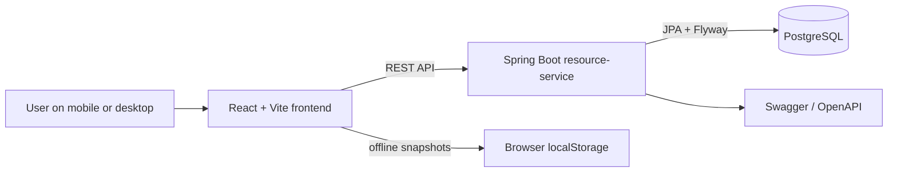
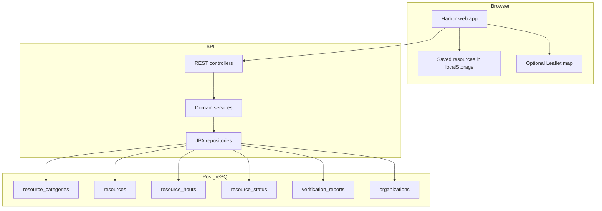
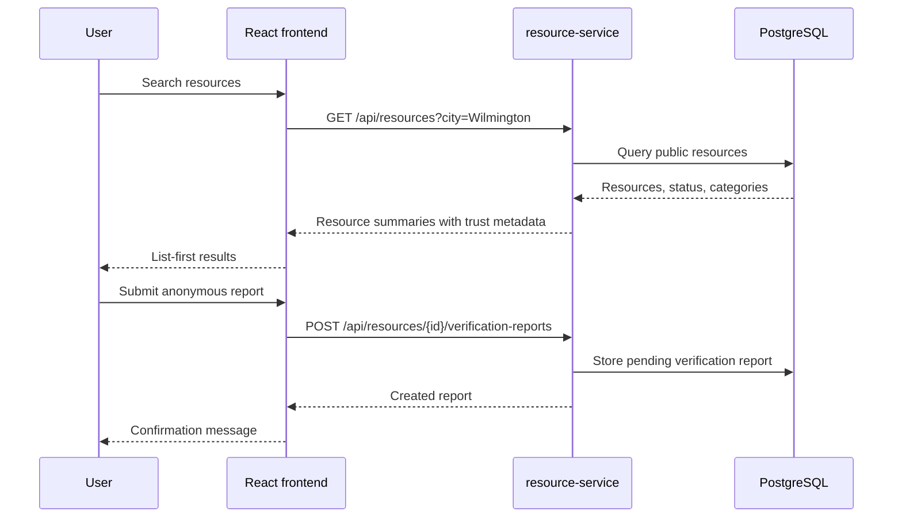
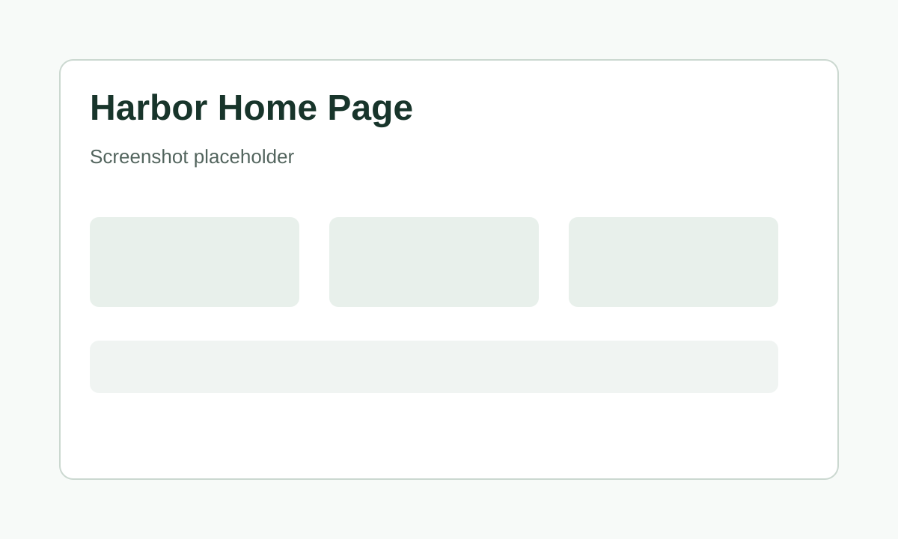
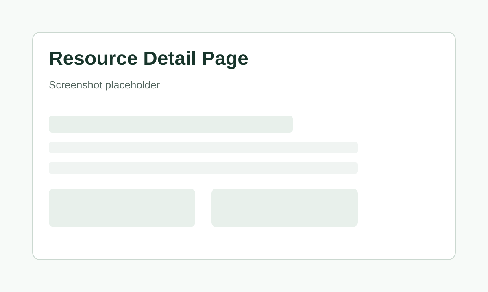
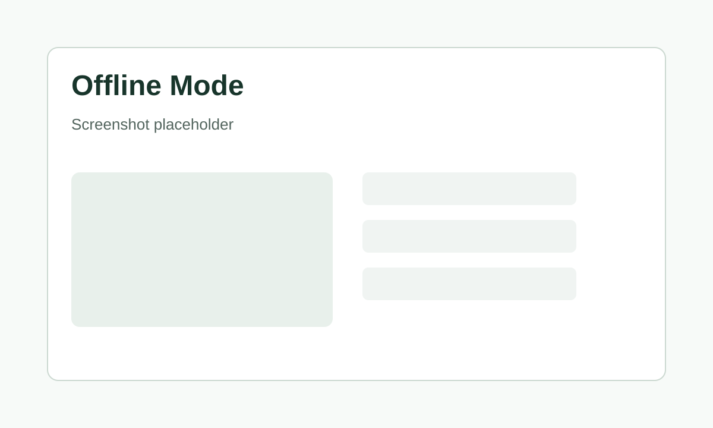
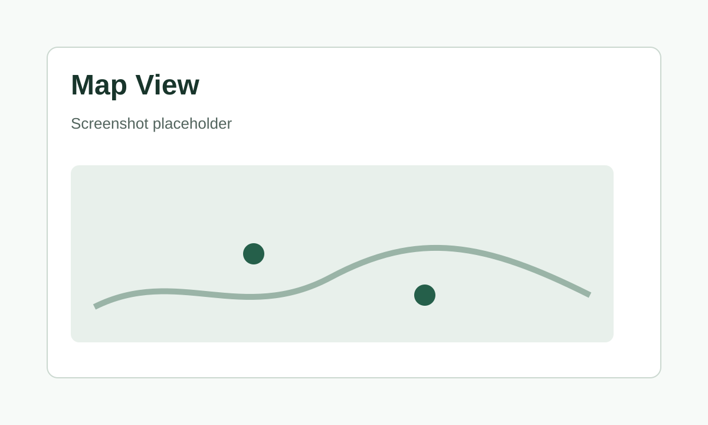
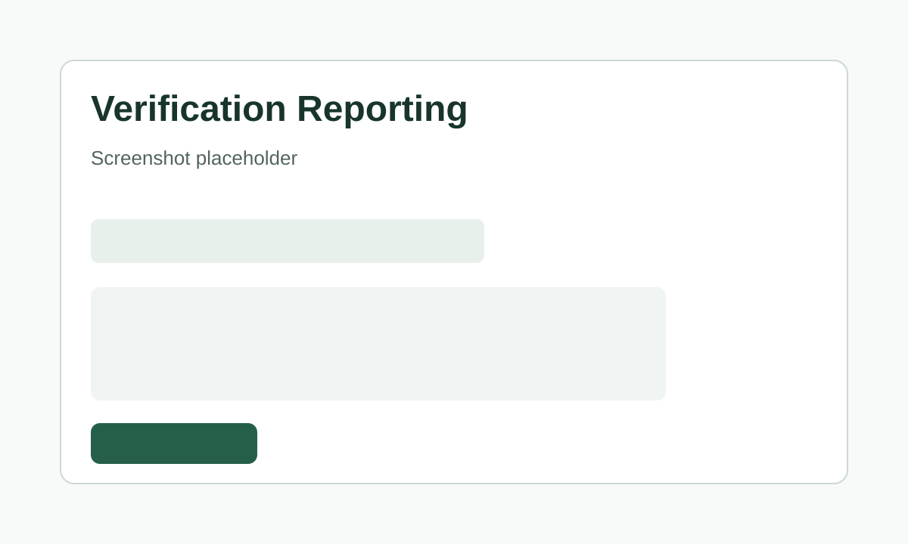

# Harbor
 

Harbor is a lightweight civic technology project for finding nearby survival resources quickly and anonymously. The current MVP+ helps people browse Wilmington, Delaware resources such as food pantries, shelters, clinics, public restrooms, libraries, charging/Wi-Fi locations, warming/cooling centers, and transportation support.

The project is intentionally practical: fast resource lookup, clear availability signals, anonymous community reporting, and a calm mobile-first interface.

## Mission

Harbor helps people find essential local resources under stressful conditions without requiring an account, exposing unnecessary personal data, or depending on heavy interfaces.

## Problem

Resource information is often scattered across PDFs, websites, phone lines, social posts, and outdated directories. For someone trying to find food, shelter, restrooms, transportation, or a place to charge a phone, the experience needs to be simple, current, and usable on a mobile device.

Harbor addresses this by providing:

- A focused public directory of survival resources.
- Anonymous browsing for core features.
- Community verification reports for freshness and trust.
- Offline-friendly saved resource snapshots.
- A list-first interface that works even when maps or bandwidth are unreliable.

## Key Features

- Browse public resources by category and city.
- View detailed resource information, including address, phone, website, hours, accessibility notes, eligibility notes, and intake notes.
- Submit anonymous verification reports for incorrect or changed information.
- See lightweight trust indicators such as community report count, recent community updates, and recently updated status.
- View recent anonymous community updates on resource detail pages.
- Save viewed resources locally for offline reference.
- Toggle an optional OpenStreetMap view while keeping the resource list primary.
- Access backend health, OpenAPI documentation, and Prometheus-compatible metrics.

## Architecture Overview

Harbor currently uses a simple full-stack architecture. The backend is designed as the first service in a future microservice system, but the current implementation keeps scope small enough for a solo developer or student project.



### Frontend / Backend / Database



### Request Flow



## Tech Stack

### Backend

- Java 21
- Spring Boot 3.5.x
- Spring Web
- Spring Data JPA / Hibernate
- PostgreSQL
- Flyway
- Bean Validation
- Lombok
- Spring Boot Actuator
- Springdoc OpenAPI / Swagger UI
- Docker

### Frontend

- React
- TypeScript
- Vite
- Tailwind CSS
- Leaflet / React Leaflet
- Browser localStorage for offline snapshots

### Development / Operations

- Docker Compose
- PostgreSQL 16
- OpenAPI documentation
- Actuator health endpoints
- Prometheus metrics endpoint
- Request correlation IDs in API responses and logs

## Screenshots

Screenshots are intentionally tracked as placeholders for now. Add final images or GIFs under `docs/screenshots/` as the UI stabilizes.

### Home Page

`docs/screenshots/home-page.svg`



### Resource Detail Page

`docs/screenshots/resource-detail.svg`



### Offline Mode

`docs/screenshots/offline-mode.svg`



### Map View

`docs/screenshots/map-view.svg`



### Verification Reporting

`docs/screenshots/verification-reporting.svg`



## API Documentation

When the backend is running locally:

- Swagger UI: `http://localhost:8081/swagger-ui.html`
- OpenAPI JSON: `http://localhost:8081/v3/api-docs`
- Health check: `http://localhost:8081/actuator/health`
- Prometheus metrics: `http://localhost:8081/actuator/prometheus`

### Main Endpoints

| Method | Endpoint | Purpose |
| --- | --- | --- |
| `GET` | `/api/categories` | List active resource categories |
| `GET` | `/api/resources` | List public resources |
| `GET` | `/api/resources?category=food` | Filter resources by category |
| `GET` | `/api/resources?city=Wilmington` | Filter resources by city |
| `GET` | `/api/resources?page=0&size=10` | Paginated resource lookup |
| `GET` | `/api/resources/{id}` | View resource detail |
| `POST` | `/api/resources/{id}/verification-reports` | Submit anonymous community report |
| `GET` | `/api/organizations` | List organizations associated with resources |

## Example API Requests

List resources:

```bash
curl http://localhost:8081/api/resources
```

Filter food resources:

```bash
curl "http://localhost:8081/api/resources?category=food&page=0&size=5"
```

View a resource:

```bash
curl http://localhost:8081/api/resources/11111111-1111-4111-8111-111111111111
```

Submit an anonymous verification report:

```bash
curl -X POST \
  http://localhost:8081/api/resources/11111111-1111-4111-8111-111111111111/verification-reports \
  -H "Content-Type: application/json" \
  -d '{
    "reportType": "shelter_full",
    "description": "Staff said no beds were available tonight.",
    "suggestedValue": {
      "reporterKind": "anonymous"
    }
  }'
```

Supported report types:

- `food_unavailable`
- `shelter_full`
- `restroom_closed`
- `wifi_offline`
- `unsafe_location`
- `incorrect_hours`
- `inaccessible`
- `other`

## Local Development Setup

### Prerequisites

- Java 21
- Docker Desktop or compatible Docker runtime
- Node.js 20 or newer
- npm

### Backend and Database

From the repository root:

```bash
docker compose up --build
```

The backend runs at:

```text
http://localhost:8081
```

The current Docker Compose setup exposes PostgreSQL on the host for local inspection:

```text
localhost:5434
```

To rebuild the database from Flyway migrations:

```bash
docker compose down -v
docker compose up --build
```

### Frontend

```bash
cd web-app
npm install
npm run dev
```

Vite usually starts at:

```text
http://127.0.0.1:5173
```

If that port is already in use, Vite may choose another `517x` port. The backend CORS configuration allows local Vite development ports in that range.

## Docker Setup

The root `docker-compose.yml` starts:

- `postgres`: PostgreSQL database with persistent Docker volume.
- `resource-service`: Spring Boot API container on port `8081`.

Common commands:

```bash
docker compose up --build
docker compose up --build -d
docker compose logs -f resource-service
docker compose down
docker compose down -v
```

## Environment Variables

Backend configuration is provided through environment variables. Use `.env.example` as a safe template and keep local `.env` files out of commits.

```text
SPRING_DATASOURCE_URL=jdbc:postgresql://postgres:5432/harbor
SPRING_DATASOURCE_USERNAME=postgres
SPRING_DATASOURCE_PASSWORD=change-me
```

Frontend configuration:

```text
VITE_API_BASE_URL=http://localhost:8081
```

## Repository Layout

```text
.
|-- docker-compose.yml
|-- README.md
|-- resource-service/
|   |-- Dockerfile
|   |-- pom.xml
|   `-- src/main/
|       |-- java/com/harbor/resourceservice/
|       |   |-- category/
|       |   |-- common/
|       |   |-- organization/
|       |   |-- resource/
|       |   `-- verification/
|       `-- resources/db/migration/
`-- web-app/
    |-- package.json
    `-- src/
        |-- api/
        |-- components/
        |-- features/
        |-- pages/
        `-- types/
```

## Engineering Decisions

### Why PostgreSQL

Resource data benefits from strong relational modeling: categories, organizations, hours, statuses, and verification reports all have clear relationships and constraints. PostgreSQL also supports mature indexing, migrations, and future geospatial options through PostGIS if Harbor later needs more advanced location search.

### Why Docker

Docker keeps local development reproducible. A reviewer can start the API and database with one command without manually installing PostgreSQL or matching local database settings.

### Why OpenStreetMap Instead of Google Maps

OpenStreetMap keeps the map experience aligned with Harbor's civic and privacy-first goals. It avoids vendor lock-in, does not require Google API keys for the MVP, and supports a lightweight optional map view while the list remains the primary interface.

### Why No Auth or Accounts Initially

The most important Harbor workflows are finding resources and reporting incorrect information. Requiring login would add friction, privacy concerns, and implementation complexity before the core public utility is proven. Account-based saved resources, admin review tools, and organization users can be added later without blocking anonymous access.

### Why List-First Design

Maps are useful, but they can be slow, battery-heavy, and harder to scan under stress. Harbor presents resources as a readable list first, with the map as a secondary option. This keeps the interface useful on small screens and unreliable connections.

### Why Accessibility and Low-Bandwidth Focus Matter

Harbor is meant for real-world use, including stressful conditions, older phones, limited battery, spotty service, and users who rely on assistive technology. Clear contrast, semantic HTML, keyboard access, readable cards, and minimal visual noise are product requirements, not polish.

## Accessibility and Design Principles

- Anonymous access for core resource browsing.
- Calm visual design with restrained colors and readable spacing.
- Mobile-first layouts with thumb-friendly controls.
- List-first browsing with optional map support.
- Clear loading, empty, and error states.
- Screen-reader friendly labels and semantic structure.
- No ads, gamification, social feeds, or unnecessary animation.
- AI is not part of the current MVP and is not required for survival-critical workflows.

## Current Scope

Harbor currently focuses on one backend service and one frontend application:

- Resource directory
- Category filtering
- Resource detail pages
- Seeded Wilmington, Delaware resource data
- Anonymous verification reports
- Community freshness metadata
- Offline local resource snapshots
- Optional map view
- API documentation and health checks

## Future Roadmap

- Add admin review workflows for pending verification reports.
- Add organization-managed resource updates.
- Add stronger data quality workflows and audit history.
- Add PostGIS-backed distance search.
- Add notification subscriptions for critical resource changes.
- Add deployment configuration for a low-cost cloud environment.
- Add observability dashboards with Prometheus and Grafana.
- Add service boundaries for notification, search, and verification only when the product needs them.
- Add optional translation and plain-language assistance after the core directory remains reliable without it.

## Portfolio Notes

Harbor is designed to demonstrate practical full-stack engineering:

- Spring Boot service design with domain-based package organization.
- PostgreSQL schema design with Flyway migrations.
- REST API design with OpenAPI documentation.
- Dockerized local development.
- React + TypeScript frontend with reusable components.
- Accessibility-aware, mobile-first product thinking.
- Clear tradeoffs around privacy, reliability, and scope control.
 
